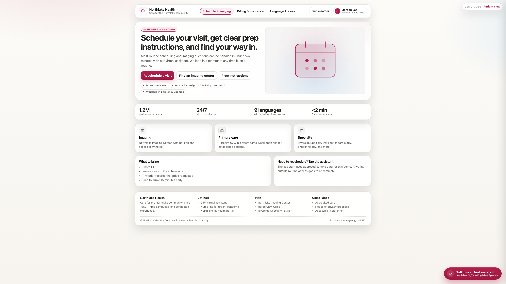
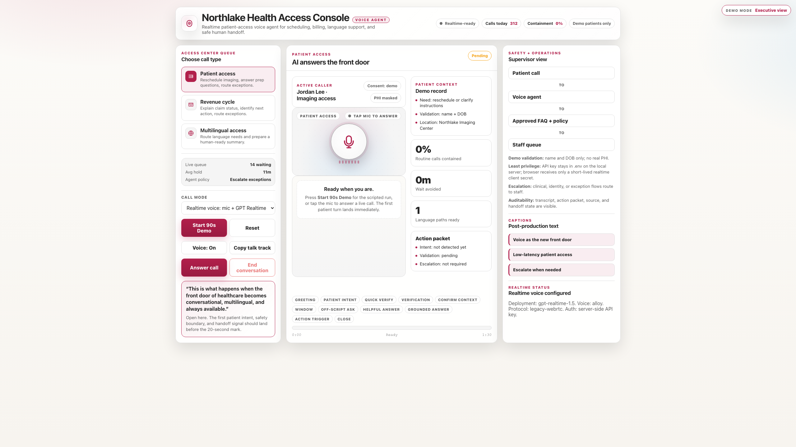
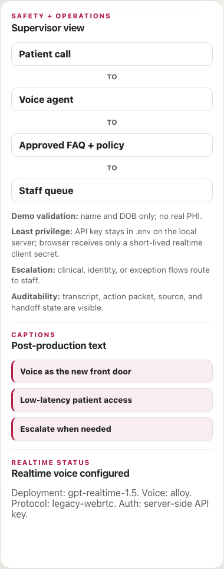
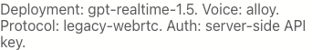

# Voice Agent for Patient Access

Executive demo for a healthcare front-door voice assistant. This project demonstrates a 90-second browser experience that combines deterministic scripted playback with optional live voice using Azure OpenAI Realtime.

## Who This Is For

This demo is intended for healthcare technology and operations leaders who need to evaluate how conversational AI can improve the patient access experience without sacrificing governance, speed, or safe staff escalation.

Typical audiences include:

- CIO teams evaluating digital front-door modernization
- CTO and architecture teams reviewing realtime AI patterns and security boundaries
- COO and access-center leaders looking to reduce avoidable call friction and improve staff efficiency

## The Challenge

Patient access teams absorb a large amount of avoidable call friction in the first few moments of an interaction. Routine needs such as rescheduling, billing clarification, location questions, and language support often compete with higher-priority work, increasing handle times, queue pressure, and staff interruptions.

This demo is designed to show a better operating model:

- patients get an immediate, conversational front door
- routine workflows stay grounded in approved policy and synthetic context
- staff receive action-ready summaries instead of raw transcripts
- exceptions and sensitive situations are handed off explicitly to humans

The goal is not to replace care teams. The goal is to reduce administrative friction, improve access consistency, and make human staff more effective where judgment matters most.

## What This Demo Shows

- a browser-based patient experience that feels like a modern health-system front door
- an executive operations console that exposes trust, status, handoff, and action-packet state
- a deterministic 90-second story for reliable demos and recordings
- an optional live voice path using Azure OpenAI Realtime with server-side credential protection

## Architecture Overview

At a high level, the demo separates the browser experience from the credentialed realtime session setup:

- the browser renders patient and executive experiences
- the local server serves static assets and mints short-lived realtime session credentials
- Azure OpenAI Realtime handles live audio, transcription, and conversational reasoning
- scenario grounding and synthetic policy context shape the response behavior
- the UI surfaces action packets, trust cues, and human handoff state

For a deeper walkthrough, see [docs/architecture.md](docs/architecture.md).

## Highlights

- Low-latency conversational UI for patient access workflows
- Grounded scenario behavior for scheduling, billing, and language access
- Action-packet and handoff visibility for operations teams
- Server-side credential boundary with short-lived browser session secrets

## Demo Scenarios

- Patient access: rescheduling, location clarification, and prep-instruction flows
- Revenue cycle: statement explanation and payment-plan style intake paths
- Language access: English and Spanish support with governed escalation for interpreter needs

## Product Screens

### Patient Experience



### Executive Console



### Realtime Status Panel





## Quick Start

```bash
python3 server.py
```

Open http://127.0.0.1:8787 and run the scripted demo.

For the most consistent walkthrough, start in scripted mode and use the patient access scenario first.

## Optional Live Voice Setup

1. Create local environment file:

```bash
cp env.example .env
```

2. Set required values in `.env`:

```bash
AZURE_OPENAI_ENDPOINT=https://YOUR-ENDPOINT.cognitiveservices.azure.com
AZURE_OPENAI_REALTIME_DEPLOYMENT=gpt-realtime-1.5
AZURE_OPENAI_API_KEY=PASTE-YOUR-KEY-HERE
AZURE_OPENAI_REALTIME_VOICE=alloy
AZURE_OPENAI_REALTIME_PROTOCOL=legacy-webrtc
AZURE_OPENAI_REALTIME_REGION=eastus2
AZURE_OPENAI_REALTIME_API_VERSION=2025-04-01-preview
REALTIME_TRANSCRIPTION_MODEL=whisper-1
PORT=8787
```

3. Restart server and refresh browser.

The right panel should show Realtime voice configured.

## Project Structure

- `index.html`: UI shell for patient and executive views
- `styles.css`: complete visual system and responsive behavior
- `app.js`: runtime orchestration, demo logic, and realtime controls
- `scenarios.js`: scripted scenario content and talk tracks
- `synthetic-data.js`: approved synthetic grounding data
- `server.py`: local static host plus realtime token endpoints
- `scripts/capture_ui_screenshots.py`: automated screenshot capture utility

## Repository Docs

- [docs/architecture.md](docs/architecture.md): high-level system architecture and trust boundary overview
- [CONTRIBUTING.md](CONTRIBUTING.md): contribution guidelines
- [SECURITY.md](SECURITY.md): security reporting guidance
- [CODE_OF_CONDUCT.md](CODE_OF_CONDUCT.md): community participation expectations
- [SUPPORT.md](SUPPORT.md): support scope and channels

## Safety and Data Handling

- Use synthetic data only for demo sessions
- Do not send PHI or production credentials through this scaffold
- Keep API keys in `.env` (server-side only)

## Disclaimer

This project is a personal demo and is not affiliated with, sponsored by, or endorsed by Microsoft.

Any references to Microsoft products (Azure, Copilot, etc.) are for demonstration purposes only.

## Screenshot Automation

Generate a fresh screenshot pack:

```bash
./.venv/bin/python scripts/capture_ui_screenshots.py
```

Output is saved to a timestamped folder under `screenshots/`.

## License

This project is licensed under the MIT License. See [LICENSE](LICENSE).
