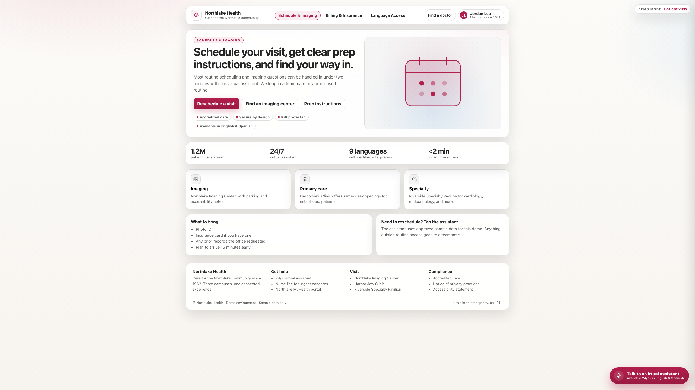
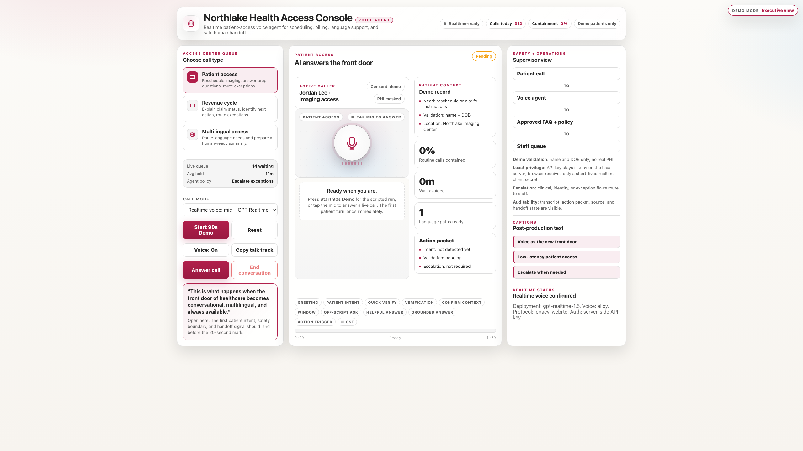
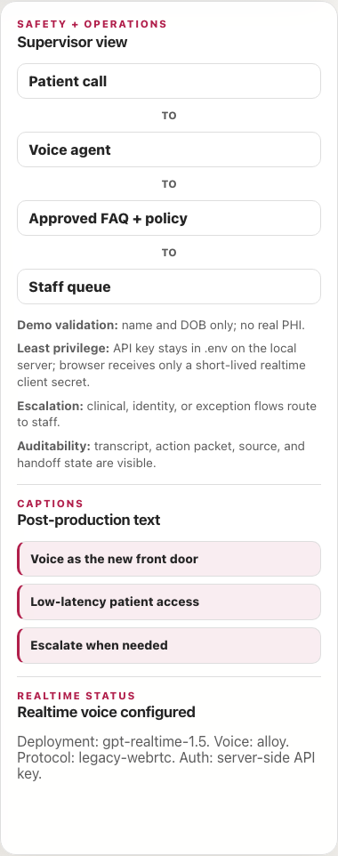
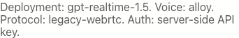

# Voice Agent for Patient Access

Executive demo for a healthcare front-door voice assistant. This project demonstrates a 90-second browser experience that combines deterministic scripted playback with optional live voice using Azure OpenAI Realtime.

## Who This Is For

This demo is intended for healthcare technology and operations leaders who need to evaluate how conversational AI can improve the patient access experience without sacrificing governance, speed, or safe staff escalation.

Typical audiences include:

- CIO teams evaluating digital front-door modernization
- CTO and architecture teams reviewing realtime AI patterns and security boundaries
- COO and access-center leaders looking to reduce avoidable call friction and improve staff efficiency

## The Challenge

Patient access teams absorb a large amount of avoidable call friction in the first few moments of an interaction. Routine needs such as rescheduling, billing clarification, location questions, and language support often compete with higher-priority work, increasing handle times, queue pressure, and staff interruptions.

This demo is designed to show a better operating model:

- patients get an immediate, conversational front door
- routine workflows stay grounded in approved demo context
- staff receive action-ready summaries instead of raw transcripts
- exceptions and sensitive situations are handed off explicitly to humans

The goal is not to replace care teams. The goal is to reduce administrative friction, improve access consistency, and make human staff more effective where judgment matters most.

## What This Demo Shows

- a browser-based patient experience that feels like a modern health-system front door
- an executive operations console that exposes trust, status, handoff, and action-packet state
- a deterministic 90-second story for reliable demos and recordings
- an optional live voice path using Azure OpenAI Realtime with server-side credential protection
- an intent-driven live conversation that can confirm an existing visit, answer approved access questions, check reschedule options, and book a selected demo slot
- a local mock scheduling tool-call loop that returns ranked available demo slots and confirms selected slots

## Architecture Overview

At a high level, the demo separates the browser experience from the credentialed realtime session setup:

- the browser renders patient and executive experiences
- the local server serves static assets and mints short-lived realtime session credentials
- Azure OpenAI Realtime handles live audio, transcription, and conversational reasoning
- scenario grounding and approved demo context shape the response behavior
- Realtime tool calls can bridge to a local mock scheduling endpoint for the patient-access scenario
- the UI surfaces action packets, trust cues, and human handoff state

For a deeper walkthrough, see [docs/architecture.md](docs/architecture.md).

## Highlights

- Low-latency conversational UI for patient access workflows
- Grounded scenario behavior for scheduling, billing, and language access
- Action-packet and handoff visibility for operations teams
- Server-side credential boundary with short-lived browser session secrets

## Demo Scenarios

- Patient access: rescheduling, location clarification, and prep-instruction flows
- Revenue cycle: statement explanation and payment-plan style intake paths
- Language access: English and Spanish support with governed escalation for interpreter needs

## Product Screens

### Patient Experience



### Executive Console



### Realtime Status Panel





## Quick Start

> ⚠️ Before sharing this folder, verify that `.env` does not exist. Prefer sharing from a clean git checkout or `git archive`, not by zipping your working directory.

Before publishing or creating a public archive:

```bash
git status --short --ignored
git ls-files | awk '{
  n = split($0, parts, "/");
  name = parts[n];
  if ((name == ".env" || name ~ /^\.env\./) && name != ".env.example") print $0
}'
```

The second command should print nothing. Only `.env.example` should appear in tracked files. Local `.env`, virtual environments, generated transcripts, screenshots, and presentation exports are ignored for safety.

```bash
python3 server.py
```

Open http://127.0.0.1:8787 and run the scripted demo.

For the most consistent walkthrough, start in scripted mode and use the patient access scenario first.

## Optional Live Voice Setup

1. Create local environment file:

```bash
cp .env.example .env
```

2. Set required values in `.env`:

```bash
AZURE_OPENAI_ENDPOINT=https://YOUR-ENDPOINT.cognitiveservices.azure.com
AZURE_OPENAI_REALTIME_DEPLOYMENT=gpt-realtime-2
AZURE_OPENAI_API_KEY=PASTE-YOUR-KEY-HERE
AZURE_OPENAI_REALTIME_VOICE=alloy
AZURE_OPENAI_REALTIME_PROTOCOL=ga-webrtc
AZURE_OPENAI_REALTIME_REGION=eastus2
AZURE_OPENAI_REALTIME_API_VERSION=2025-04-01-preview
# Azure may require this to be the name of an existing transcription model deployment.
REALTIME_TRANSCRIPTION_MODEL=whisper-1
PORT=8787
# Optional: generate ignored conversation-script.md on server startup.
GENERATE_CONVERSATION_SCRIPT=0
```

3. Restart server and refresh browser.

The right panel should show Realtime voice configured.

The primary live voice path now targets `gpt-realtime-2` with GA WebRTC. The older `legacy-webrtc` path remains in the code only as a fallback for previous `gpt-realtime-1.5` deployments.

The GA WebRTC path uses `/openai/v1/realtime/client_secrets` for short-lived session credentials and `/openai/v1/realtime/calls` for the browser SDP exchange. The local demo keeps the data-channel event stream unfiltered so the browser can receive Realtime function-call events and return `function_call_output` for the scheduling tool.

Realtime diagnostics are available from the browser console with `voiceDemoDiagnostics()`. To also mirror realtime event logs to the console, open the page with `?debugRealtime` or set `localStorage.voiceDemoDebug = "1"`.

### Mock Scheduling Tool

In the patient-access scenario, live voice mode is intentionally intent-driven rather than script-locked. Riley first verifies the caller by name and date of birth, even when the user is signed in to MyHealth. After verification, callers can confirm they will attend, ask routine access questions, request a reschedule, choose from offered options, or change direction mid-call. Riley uses the approved demo data as factual grounding, uses the run-of-show as examples for tone, and is prompted to end each turn with a clear next step or bounded question.

For rescheduling, live voice mode exposes a local Realtime tool named `confirm_appointment_reschedule`. When Riley has validated the caller and captured a requested appointment window, the model can request that tool. The browser bridges the model tool call to `/api/demo-tools/confirm-appointment`, which returns deterministic mock availability, then sends the result back to Realtime as `function_call_output` for the same tool-call ID.

- Broad patient-access windows such as "Thursday" or "Friday morning" return ranked available slots so Riley can work through choices naturally before booking.
- Exact selected slots such as "Thursday at 2:15 PM" or "Friday at 11:30 AM" return a mock confirmation number.
- Revenue-cycle and multilingual scenarios return an unsupported scheduling result and route to staff.

The tool is a local stub only. It does not call scheduling, EHR, CRM, billing, or contact-center systems.

Automated mock rescheduling is the primary demo flow. Callback tasks are fallback behavior only when the mock scheduling system cannot complete the request or staff judgment is needed.

## Project Structure

- `index.html`: UI shell for patient and executive views
- `styles.css`: complete visual system and responsive behavior
- `app.js`: runtime orchestration, demo logic, and realtime controls
- `scenarios.js`: scripted scenario content and talk tracks
- `synthetic-data.js`: approved demo grounding data
- `server.py`: local static host plus realtime token endpoints
- `generate_script.js`: optional generator for the ignored `conversation-script.md` validation transcript
- `scripts/capture_ui_screenshots.py`: automated screenshot capture utility

## Repository Docs

- [docs/architecture.md](docs/architecture.md): high-level system architecture and trust boundary overview
- [docs/path-to-mvp.md](docs/path-to-mvp.md): forward-looking FAQ on what it would take to evolve this demo into a real MVP
- [CONTRIBUTING.md](CONTRIBUTING.md): contribution guidelines
- [SECURITY.md](SECURITY.md): security reporting guidance
- [CODE_OF_CONDUCT.md](CODE_OF_CONDUCT.md): community participation expectations
- [SUPPORT.md](SUPPORT.md): support scope and channels

## Safety and Data Handling

- Use approved demo data only for demo sessions
- Do not send PHI or production credentials through this scaffold
- Keep API keys in `.env` (server-side only)

## Disclaimer

This project is a personal demo and is not affiliated with, sponsored by, or endorsed by Microsoft.

Any references to Microsoft products (Azure, Copilot, etc.) are for demonstration purposes only.

## Screenshot Automation

Generate a fresh screenshot pack:

```bash
./.venv/bin/python scripts/capture_ui_screenshots.py
```

Output is saved to a timestamped folder under `screenshots/`.

## From Demo to MVP

This repo is a demo, not a product. If you are wondering what it would take to move a pattern like this toward a real MVP in a health system, see [docs/path-to-mvp.md](docs/path-to-mvp.md).

It is a forward-looking FAQ covering scope, identity, EHR integration, grounding, clinical and HIPAA governance, security, operations and telemetry, architecture evolution, and rollout stages. It is a starting frame for stakeholder conversations, not implementation guidance for any specific organization.

## Optional Transcript Artifact

`conversation-script.md` is generated and ignored by default so local demo runs do not dirty the working tree. If you want a rich transcript artifact for review or validation, run:

```bash
node generate_script.js
```

or start the server with:

```bash
GENERATE_CONVERSATION_SCRIPT=1 python3 server.py
```

Review generated transcripts for sensitive content before sharing them.

## License

This project is licensed under the MIT License. See [LICENSE](LICENSE).
