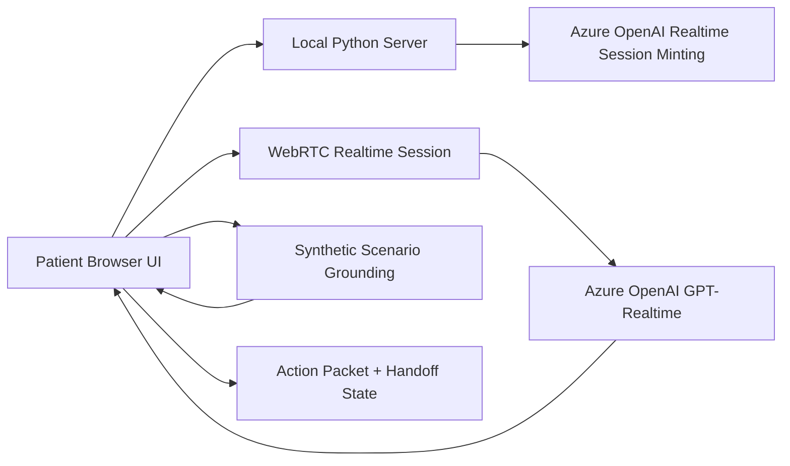

# Architecture Overview

This sample demonstrates a patient access voice-agent experience with a clear separation between browser UX, realtime orchestration, and credential handling.

## Goals

- keep the scripted demo reliable for recordings and executive walkthroughs
- support an optional live voice path for realtime demonstrations
- keep long-lived credentials on the server
- use synthetic grounding data and visible trust boundaries
- surface action packets and handoff state in the UI

## High-Level Flow

## Trust Boundary

- The browser never receives the long-lived Azure API key
- The local server holds environment configuration and mints short-lived session credentials
- Synthetic data is used to simulate workflows and validation prompts
- Human handoff remains explicit for exceptions and non-routine needs

## Runtime Components

### Browser

- patient-facing experience
- executive operations console
- scripted playback UI
- optional microphone/WebRTC session

### Local Server

- serves static assets
- exposes realtime status endpoint
- creates short-lived realtime session credentials
- generates conversation script artifact for demo alignment

### Azure Realtime Layer

- speech-to-speech or multimodal interaction
- transcription and turn handling
- grounded conversational response generation

## Demo Modes

### Scripted Mode

Use this for the most reliable recordings and repeatable demonstrations.

### Realtime Mode

Use this to demonstrate live latency, live transcripts, and the server-side auth boundary.

## External Sharing Notes

This repository is intentionally scoped as a sample. It does not include production integrations for EHR, CRM, identity, scheduling, or contact-center systems. Those seams are represented in the experience, but they are not implemented as production connectors in this codebase.
