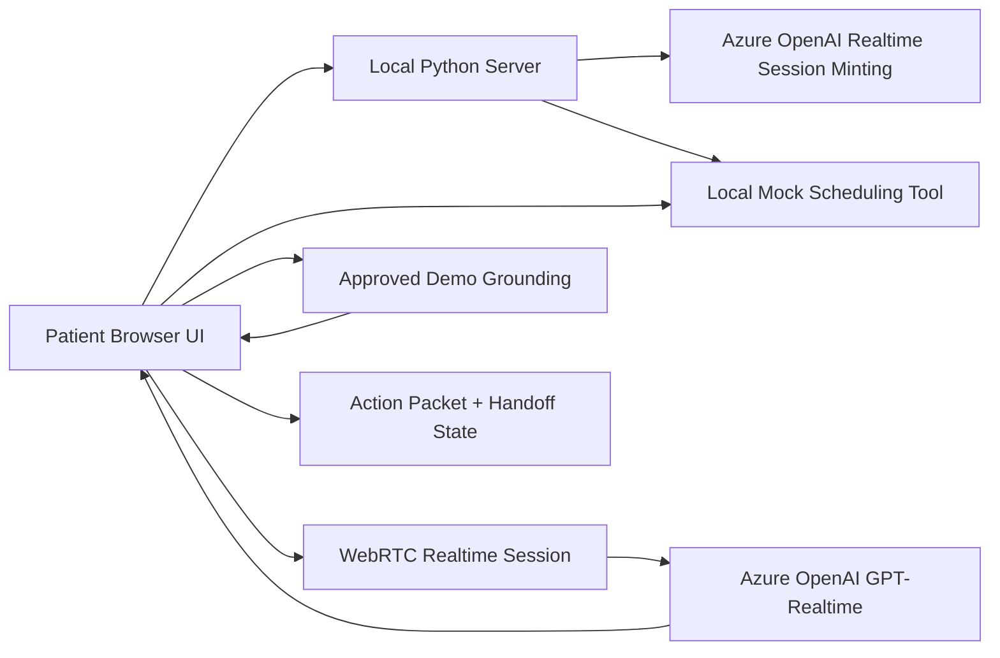

# Architecture Overview

This sample demonstrates a patient access voice-agent experience with a clear separation between browser UX, realtime orchestration, and credential handling.

## Goals

- keep the scripted demo reliable for recordings and executive walkthroughs
- support an optional live voice path for realtime demonstrations
- keep long-lived credentials on the server
- use approved demo grounding data and visible trust boundaries
- demonstrate a local mock scheduling tool call without touching production systems
- surface action packets and handoff state in the UI

## High-Level Flow

```mermaid
flowchart LR
    A[Patient Browser UI] --> B[Local Python Server]
    B --> C[Azure OpenAI Realtime Session Minting]
    B --> H[Local Mock Scheduling Tool]
    A --> D[WebRTC Realtime Session]
    D --> E[Azure OpenAI GPT-Realtime]
    A --> F[Approved Demo Grounding]
    E --> A
    F --> A
    A --> G[Action Packet + Handoff State]
    A --> H
```

## Trust Boundary

- The browser never receives the long-lived Azure API key
- The local server holds environment configuration and mints short-lived session credentials
- Approved demo data is used to simulate workflows and validation prompts
- The mock scheduling tool is local-only and does not update live scheduling, EHR, CRM, billing, or contact-center systems
- Human handoff remains explicit for exceptions and non-routine needs

## Runtime Components

### Browser

- patient-facing experience
- executive operations console
- scripted playback UI
- optional microphone/WebRTC session

### Local Server

- serves static assets
- exposes realtime status endpoint
- creates short-lived realtime session credentials
- exposes `/api/demo-tools/confirm-appointment` for deterministic mock scheduling availability
- can generate an ignored conversation script artifact for demo alignment when `GENERATE_CONVERSATION_SCRIPT=1`

### Azure Realtime Layer

- speech-to-speech or multimodal interaction
- transcription and turn handling
- grounded conversational response generation
- Realtime tool-call requests for the local mock scheduling workflow in the patient-access scenario

## Demo Modes

### Scripted Mode

Use this for the most reliable recordings and repeatable demonstrations.

### Realtime Mode

Use this to demonstrate live latency, live transcripts, the server-side auth boundary, and a more natural intent-driven conversation. The live prompt requires voice-channel verification even for signed-in MyHealth users, then treats the scripted run-of-show as example tone and behavior while allowing callers to confirm an existing visit, ask approved access questions, request a reschedule, choose a scheduling option, or change direction mid-call.

The primary live path uses `gpt-realtime-2` with GA WebRTC. Legacy WebRTC remains available only as an older deployment fallback.

### Mock Scheduling Tool

The patient-access scenario exposes `confirm_appointment_reschedule` as a Realtime tool. The browser receives the model's function call over the Realtime data channel, calls the local Python stub, then returns the tool output to the model as `function_call_output` using the same tool-call ID. The stub waits briefly so the demo visibly feels like an external scheduling lookup, then deterministically returns ranked available slots for broad requests or a mock confirmation for an exact selected slot.

The live path uses Azure OpenAI GA WebRTC endpoints: `/openai/v1/realtime/client_secrets` for short-lived session credentials and `/openai/v1/realtime/calls` for the browser SDP exchange. The demo intentionally does not enable `webrtcfilter=on` because the browser owns the local tool bridge and needs the full Realtime data-channel event stream for function-call handling. A production architecture should not stop at token minting: the server-side session service should manage WebRTC session lifecycle, tool authorization, PHI screening, session state, transcript retention, cache boundaries, and audit events. A production architecture that must hide prompt/session details from the browser should move the tool bridge to a server-side observer/controller.

Automated mock rescheduling is the primary flow. Staff callbacks are fallback behavior only when the stub returns unsupported/error, the caller rejects the alternate, or the request requires human judgment. The browser handles multiple GA Realtime function-call event shapes so the tool bridge still runs if the service emits the function call through `response.function_call_arguments.done`, `response.output_item.done`, `conversation.item.done`, or `response.done`.

## External Sharing Notes

This repository is intentionally scoped as a sample. It does not include production integrations for EHR, CRM, identity, scheduling, or contact-center systems. Those seams are represented in the experience, but they are not implemented as production connectors in this codebase.

Generated transcripts are intentionally ignored by git. Run `node generate_script.js` or start the server with `GENERATE_CONVERSATION_SCRIPT=1` if you want a local `conversation-script.md` artifact for validation or demo review. Do not commit generated transcripts unless you have reviewed them for sensitive content.
